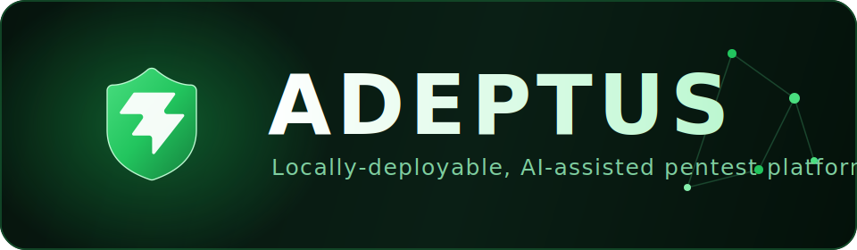
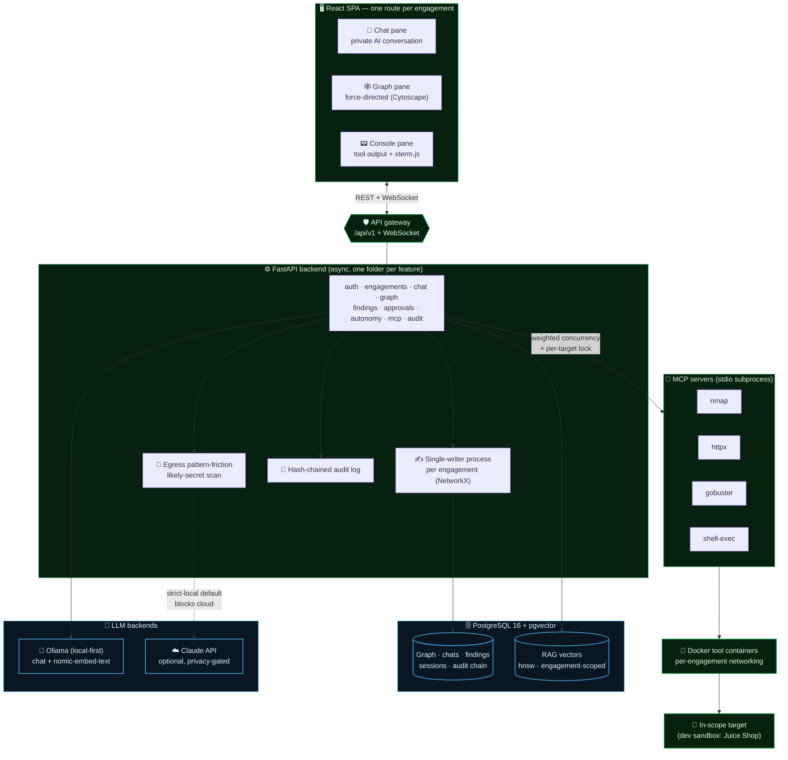
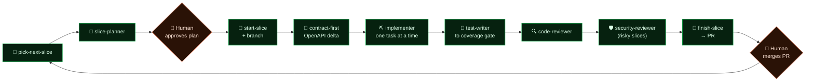

<div align="center">



### Locally-deployable, AI-assisted penetration testing platform

A multi-user pentest workbench that pairs each operator with a **private AI conversation**
while maintaining a **shared, engagement-scoped knowledge graph** — local-first, human-in-the-loop, and extensible through MCP.

<br/>

[](LICENSE)
[](https://github.com/SelfishCoconut/adeptus/stargazers)
[](https://github.com/SelfishCoconut/adeptus/commits)
[](docs/slices/PROJECT_PLAN.md)
[](CLAUDE_CODE_ARCHITECTURE.md)

[](#)
[](#)
[](#)
[](#)
[](#)
[](#)
[](#)
[](#)

<br/>

[✨ Features](#-features) • [🧩 Architecture](#-architecture) • [🤖 How it's built](#-how-its-built) • [🚀 Getting started](#-getting-started) • [🧭 Roadmap](#-roadmap) • [🔒 Security](#-security--legal)

</div>

---

## ✨ Features

Adeptus is built for small red teams (2–5 people) doing **web application engagements**, with an
architecture that leaves the door open for internal network mapping later. Everything below is
designed around three rules: *engagement isolation is sacrosanct*, *human-in-the-loop where it
matters*, and *the AI shows its work*.

| | |
| --- | --- |
| **🧠 AI you can trust** | Local-first chat via **Ollama**; optional, privacy-gated **Claude API**. The AI keeps a visible running plan, flags low-confidence claims with a stated **certainty %**, and asks clarifying questions instead of guessing. |
| **🛡️ Human-in-the-loop safety** | Two-tier autonomy: recon runs free, **dangerous actions are approval-gated** inline in chat. Any member can approve/reject — attribution and a `self_approved` flag are always recorded. Soft scope enforcement + global kill switch. |
| **🕸️ Shared knowledge graph** | One **single-writer process per engagement** (NetworkX → PostgreSQL) serializes every write, eliminating races. Force-directed Cytoscape view, soft-delete history, a personal 20-step undo stack, pins, notes, and manual attack paths. |
| **🔌 Extensible tooling (MCP)** | One **MCP server per tool category** over stdio. Weighted concurrency (`light`/`heavy`) with a per-target lock, Docker-isolated execution, a manual tool runner, and an embedded `xterm.js` terminal. Ships with **nmap · httpx · gobuster · shell-exec**. |
| **🎯 Findings & attack paths** | Simple severity by default (Critical→Info), optional **CVSS 3.1/4.0** & **OWASP Risk**, **MITRE ATT&CK** tags. Verification + remediation lifecycle, AI-proposed dedup merges, and AI-proposed attack chains. |
| **📚 RAG & retest** | Curated KB (OWASP / CVE / ATT&CK) + per-engagement uploads, **strictly isolated** per engagement via `pgvector` (`hnsw`, `WHERE engagement_id`). Archived engagements can seed a **retest** as background context only. |
| **🔒 Privacy & audit** | **Strict local-only by default** with a persistent privacy banner. Cloud egress passes a **secret-pattern friction** check. A **hash-chained, tamper-evident audit log** is the single source of truth for provenance. Credentials encrypted at rest. |
| **👥 Collaboration & ops** | Presence, typing indicators, `@`-mentions into a shared channel, an in-app notifications panel, a **session-replay timeline scrubber**, on-demand Markdown reports, an admin dashboard, and token/cost tracking. |

---

## 🧩 Architecture

A single Docker Compose stack: a React SPA over a FastAPI backend, PostgreSQL + pgvector for state
and vectors, Ollama for local inference, and MCP subprocesses driving Docker-isolated pentest tools.



> **Why single-writer?** Every graph mutation — from users, the AI, and tool-result ingestion — is
> serialized through one process per engagement. Write races are impossible by construction, so the
> AI only ever mediates *semantic* conflicts (e.g. "Apache" vs "nginx"), never write ordering.
> See [`docs/decisions/0001-*`](docs/decisions/) and [`backend/app/features/graph/writer.py`](backend/app/features/graph/).

---

## 🤖 How it's built

Adeptus is built **with Claude Code**, under strict **vertical-slice discipline**: every feature
ships end-to-end (UI + API + DB + tests) as exactly one PR. Subagents do investigation and review in
isolated context windows, skills automate the repeatable workflow, and hooks enforce non-negotiables
deterministically. The full operational architecture lives in
[`CLAUDE_CODE_ARCHITECTURE.md`](CLAUDE_CODE_ARCHITECTURE.md).



---

## 🛠️ Tech stack

| Layer | Choice |
| --- | --- |
| **Packaging** | Docker Compose (API + DB + frontend + Ollama in one stack), Linux (Kali / Parrot / Ubuntu) |
| **Backend** | Python 3.12 · FastAPI (async) · SQLAlchemy 2.x + Alembic · Pydantic v2 · `argon2` |
| **Frontend** | Vite · React 18 · TypeScript (strict) · TanStack Query · Zustand · Tailwind + shadcn/ui · Cytoscape · xterm.js |
| **Database** | PostgreSQL 16 + `pgvector` (`hnsw` ANN) |
| **Graph** | NetworkX in-memory, single-writer process per engagement, persisted to Postgres |
| **LLM** | Ollama (local-first, default small quantized model) · Claude API (optional, per-engagement) |
| **Embeddings** | `nomic-embed-text` via Ollama |
| **Tools / MCP** | stdio MCP subprocess per tool category · Docker tool containers · per-engagement networking |
| **Transport** | REST + WebSockets |

---

## 🚀 Getting started

> [!WARNING]
> Adeptus runs offensive tooling. Only point it at systems you are **explicitly authorized** to test.
> In dev/test, pentest tools are hook-blocked against anything other than the bundled sandbox.

```bash
# Bring up the full stack (API + DB + frontend + Ollama), hot-reload
make dev

# Bring up the intentionally-vulnerable sandbox to test tooling safely
make sandbox            # Juice Shop on http://localhost:3000

# Run everything CI runs: lint + typecheck + tests + coverage gate
make test
```

Other essentials: `make migrate` (Alembic upgrade), `make generate-api` (regenerate the typed
OpenAPI client after backend contract changes), `make format`. See `make help` or
[`CLAUDE.md`](CLAUDE.md) for the full list.

<details>
<summary><b>Day-0 setup for building with Claude Code</b></summary>

```bash
# 1. Install pre-commit hooks
pre-commit install
pre-commit install --hook-type commit-msg

# 2. Make Claude Code hooks executable
chmod +x .claude/hooks/*.sh

# 3. Start Claude Code in this directory
claude

# 4. Install plugins (one-time, user scope)
> /plugin install feature-dev@claude-plugins-official
> /plugin install code-review@claude-plugins-official
> /plugin install frontend-design@claude-plugins-official
> /plugin install commit-commands@claude-plugins-official

# 5. Add MCP servers (one-time)
> /mcp add context7
> /mcp add postgres
> /mcp add playwright
> /mcp add github

# 6. Drive the per-slice loop
> use pick-next-slice     # picks the next todo slice, delegates to slice-planner
> use start-slice NN      # plan-gated execution — waits for your approval before code
```

</details>

---

## 📂 Repository layout

```
.claude/        — Claude Code config: agents, skills, hooks, settings.json
backend/        — FastAPI; one folder per feature in app/features/
frontend/       — Vite + React + TS; mirrors backend feature folders
mcp-servers/    — Internal MCP servers (one per tool category)
sandbox/        — Juice Shop sandbox compose for safe pentest-tool testing
docs/
  requirements.md      — locked spec (authoritative)
  architecture.md      — living architecture
  decisions/           — ADRs
  slices/              — vertical slice specs + PROJECT_PLAN.md
  runbooks/            — operational how-tos
.github/workflows/     — CI (lint, typecheck, test, secret-scan)
```

---

## 🧭 Roadmap

Vertical slices are tracked in [`docs/slices/PROJECT_PLAN.md`](docs/slices/PROJECT_PLAN.md) (the
source of truth) and mirrored to GitHub Issues. **21 of 42 slices are merged.**

| Phase | Theme | Status |
| --- | --- | --- |
| **A** | Foundation — auth, engagements, privacy mode | ✅ done |
| **B** | Core mechanics — MCP tools, concurrency, graph, audit hash-chain | ✅ done |
| **C** | AI integration — local/cloud LLM, autonomy, approvals, personas | ✅ done |
| **D** | Findings & attack paths — lifecycle, dedup, ATT&CK | 🚧 in progress |
| **E** | RAG & retest — curated KB, uploads, retest workflow | ⬜ planned |
| **F** | Collaboration & polish — presence, mentions, replay, terminal | ⬜ planned |
| **G** | Reporting & ops — reports, admin dashboard, backups, TLS | ⬜ planned |

---

## 🔒 Security & legal

- **Authorized use only.** Adeptus is for engagements you are contracted and authorized to perform.
- **Sandbox-only in dev/test.** A pre-bash hook blocks pentest tools against any non-sandbox target;
  the only authorized real target in development is the bundled Juice Shop sandbox.
- **Legal gate.** A one-time terms-of-use acceptance is required on first login.
- **Privacy is safe-by-default.** New engagements are strict local-only; cloud egress requires an
  explicit admin opt-in and passes the secret-pattern friction check.
- **Tamper-evident audit.** Every tool run, AI call, graph edit, login, and approval is recorded in a
  hash-chained audit log.

---

## 📜 License

[Apache-2.0](LICENSE) — see [`docs/decisions/0005-license-apache-2.md`](docs/decisions/).

<div align="center">
<br/>
<sub>Built with <a href="https://claude.com/claude-code">Claude Code</a> · one vertical slice at a time.</sub>
</div>
